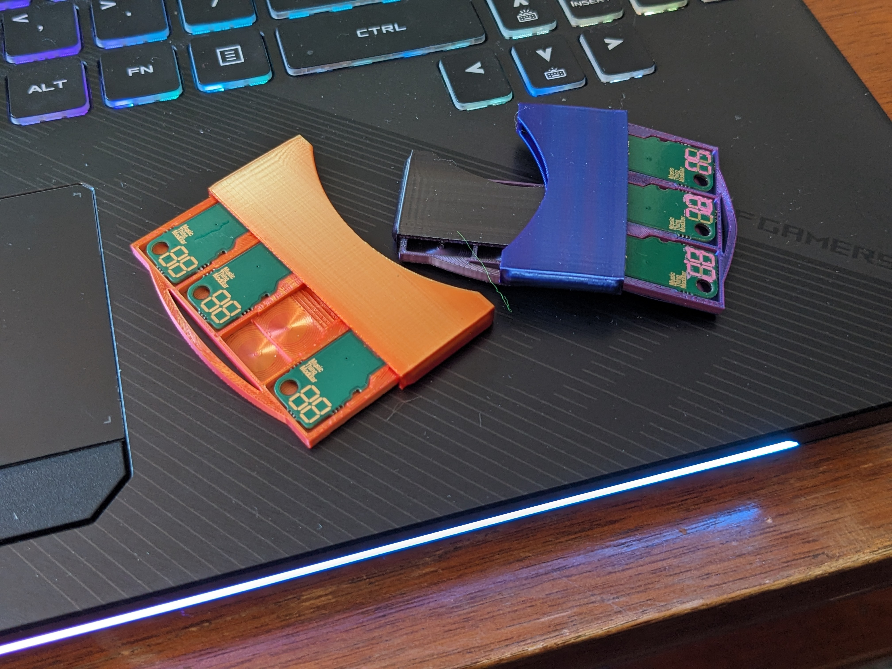

# MTM_WS_Accessories
Accessories include Workshop System Computer Card Holders, Camera Adapters, and possibly more to come?

## Card Holders
A Case for the Music Thing Modular Workshop System Computer Cards.

Printed on a Bambu A1 Mini with 0.2 mm nozzle and support

## Cellphone Camera Mounts
Two different styles, both requiring an actual cellphone camera holder with 1/4-20 threaded mounting hole. Both wedge into the slots of the hinge, and can be theoretically further secured with slight case modification, 2x M3 screws, and heatset inserts; an exercise I have found to be unnecessary.
One longer style works with just the cellphone holder,

while the other is shorter, and requires a 1/4-20 heat set insert to be used with a magic arm style camera mount, pictured with an 11 inch arm. This is ultimately more expensive, but gives greater flexibility in camera positioning.

Both printed in PETG with a 0.4mm nozzle. Could be reworked to be used with a normal hex nut.
